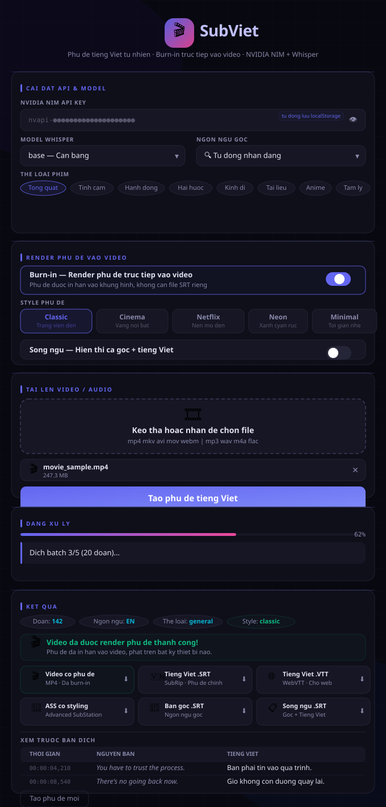
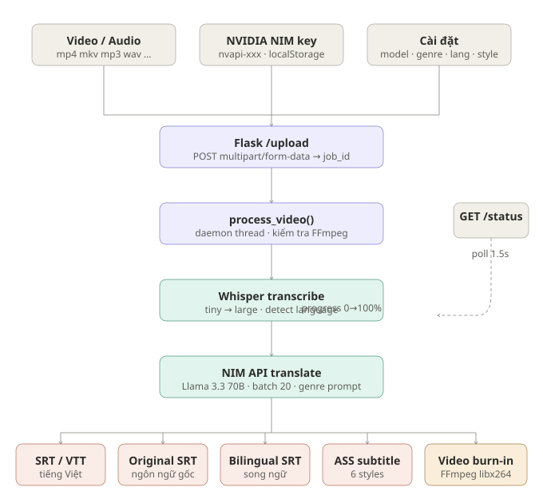

# 🎬 SubViet — Auto Subtitle Tiếng Việt Tự Nhiên

Tool tự động tạo phụ đề tiếng Việt **tự nhiên** từ video/audio, powered by:
- 🎙️ **OpenAI Whisper** — Nhận dạng giọng nói (tiny / base / small / medium / large)
- 🤖 **NVIDIA NIM API** (Llama 3.3 70B) — Dịch tự nhiên theo thể loại nội dung

---

## 🖥️ Giao diện Web



---

## 🗺️ Pipeline xử lý



---

## 🚀 Cài đặt

```bash
cd auto-subtitle
pip install -r requirements.txt
```

> Lần đầu chạy sẽ tự tải Whisper model (tiny ~75MB, base ~145MB, medium ~1.5GB)

```bash
python app.py
```

Truy cập: **http://localhost:5000**

---

## ✨ Tính năng Web UI

**Cài đặt chung**
- Nhập NVIDIA NIM API Key — **tự động lưu vào localStorage**, không mất khi refresh
- Chọn Whisper model: tiny / base / small / medium / large
- Chọn ngôn ngữ gốc: Auto / English / 日本語 / 한국어 / 中文 / Français / Español / Deutsch / ภาษาไทย
- Chọn thể loại: Tổng quát / Tình cảm / Hành động / Hài hước / Kinh dị / Tài liệu / Anime / Tâm lý

**Burn-in (render phụ đề vào video)**
- Toggle bật/tắt burn-in (chỉ hoạt động với file video)
- 6 style phụ đề: 🎬 Classic · 🌟 Cinema · 🟥 Netflix · 💜 Neon · ⬜ Minimal · 🎭 Drama
- Chỉnh chất lượng video CRF (18–32)

**Song ngữ**
- Toggle bật/tắt song ngữ — dòng gốc nhỏ phía trên, tiếng Việt lớn phía dưới

**Upload & kết quả**
- Drag & drop hoặc click để chọn file
- Thanh tiến trình real-time (poll mỗi 1.5s)
- Xem trước bảng phụ đề (gốc + tiếng Việt)
- Tải về: SRT / VTT / Song ngữ SRT / ASS / Video burn-in MP4

---

## ⌨️ Dùng CLI

```bash
# Cơ bản
python cli.py video.mp4 --key nvapi-xxx

# Nâng cao
python cli.py movie.mkv --key nvapi-xxx --genre romance --model small --bilingual

# Anime/phim Nhật
python cli.py anime.mp4 --key nvapi-xxx --genre anime --lang ja --model medium
```

### Tham số CLI:

| Tham số | Mô tả | Mặc định |
|---------|-------|---------|
| `--key` | NVIDIA NIM API Key | Bắt buộc |
| `--model` | Whisper: tiny/base/small/medium/large | base |
| `--lang` | Ngôn ngữ gốc: auto/en/ja/ko/zh/fr/es/de/th | auto |
| `--genre` | Thể loại: general/romance/action/comedy/horror/documentary/anime/drama | general |
| `--bilingual` | Xuất thêm file song ngữ | False |
| `--output` | Thư mục output | Cùng thư mục video |

---

## 📁 Định dạng hỗ trợ

**Video:** mp4, mkv, avi, mov, webm  
**Audio:** mp3, wav, m4a, flac, ogg

## 📤 Output

| File | Mô tả |
|------|-------|
| `*_vi.srt` | Phụ đề tiếng Việt (SubRip) |
| `*_vi.vtt` | Phụ đề tiếng Việt (WebVTT) |
| `*_original.srt` | Ngôn ngữ gốc |
| `*_bilingual.srt` | Song ngữ gốc + tiếng Việt |
| `*_vi.ass` | ASS subtitle (dùng để burn-in) |
| `*_subtitled.mp4` | Video đã burn-in phụ đề |

---

## 🔑 Lấy NVIDIA NIM API Key

1. Truy cập [build.nvidia.com](https://build.nvidia.com)
2. Đăng ký / đăng nhập
3. Vào **API Keys** → Tạo key mới
4. Key có format: `nvapi-xxxxxxxxx`

---

## 💡 Mẹo chọn Model Whisper

| Model | RAM | Tốc độ | Độ chính xác |
|-------|-----|--------|--------------|
| tiny | ~1GB | ⚡⚡⚡ | ★★☆ |
| base | ~1GB | ⚡⚡ | ★★★ |
| small | ~2GB | ⚡ | ★★★★ |
| medium | ~5GB | 🐢 | ★★★★★ |
| large | ~10GB | 🐢🐢 | ★★★★★ |
